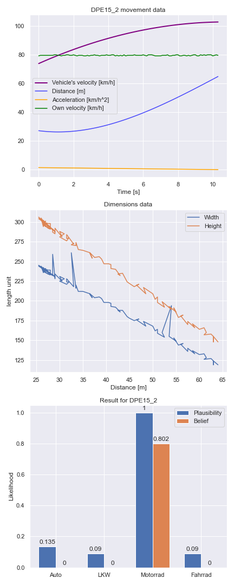
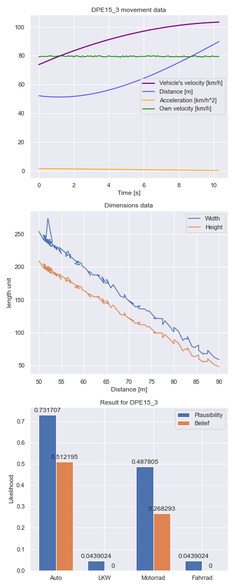
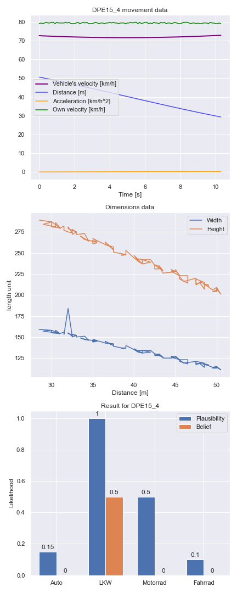
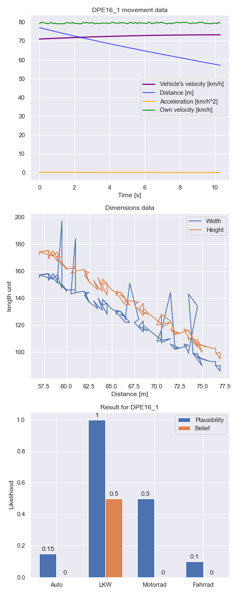

# KI - Projekt: Evidenztheorie

Anhand von Sensor-Daten soll kassifiziert werden, ob es sich bei dem vermessenen Objekt um einen PKW, einen LKW, ein Motorrad oder ein Fahrrad handelt.
<br>
Folgende Kategorien werden unterschieden: <br>

| <b>KFZ-Art<b> | <b>Geschwindigkeit</b> | <b>Beschleunigung</b>| <b>Höhe</b> | <b>Breite</b> |
| --------------|------------------------|----------------------|-------------|-------------- |
| <b>Fahrrad</b> | Langsam | - | hoch | schmal |
| <b>PKW</b> | Mittel | - | flach | breit |
| <b>LKW</b> | Mittel | Schwach | hoch | breit |
| <b>Motorrad</b> | Mittel | Stark | hoch | schmal |

- Mittlere Geschwindigkeit zwischen 50 und 90 km/h.

## Schritte / Methoden:
1. [Daten](data/) einlesen, explorieren + neue Datensätze berechnen.
2. Grenzwerte für 'hoch', 'flach', 'starke Beschleunigung', ... berechnen.
3. Einzelne Datensequenzen einlesen und Fahrzeugart mithilfe von `python_evidence`-Framework bestimmen.
  1. Werte (Geschw., Beschl., ...) bestimmen.
  2. Evidenz-Messungen (+ Wahrscheinlichkeiten) festlegen.
  3. Fahrzeugart bestimmen.

## Hinweis
- Sensoren arbeiten auf hohen Entfernungen ungenauer:
  - Mögliche Fehlerquelle, möglicherweise korrigieren / einberechnen.

## Erstellte Dateien
Folgende Dateien / Projekte sind enstanden:
* [python_evidence](/python_evidence): Framework für Evidenztheorie.
* [test.py](test.py): Systemtest des Frameoworks anhand eines Beispiels aus der Vorlesung.
* [utils.py](utils.py): Hauptdatei für Sensordaten-Berechnungen.
* [main.ipynb](main.ipynb): Hauptdatei des Projekts. 

Um die gewünschten Datei ausführen zu können, müssen alle verwendeten Frameworks installiert werden:
_Empfehlung: Virtuelle Python-Umgebung (virtualenv) nutzen._

```
pip install -r requirements.txt
```

## Ergebnisse
Folgende Fahrzeugarten wurden den jeweiligen Sensordaten von dem System zugeordnet:







